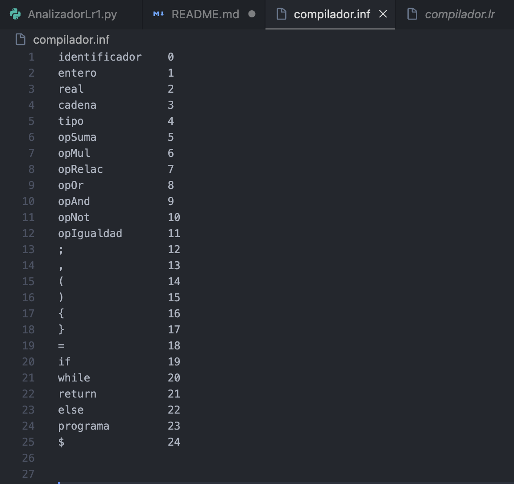
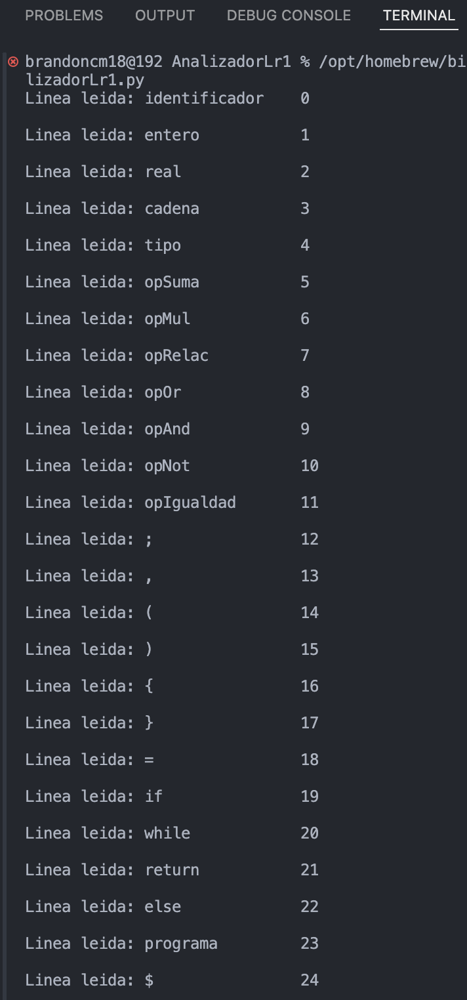

# README - Analizador LR(1)

## Descripción
Este programa es un **analizador LR(1)** que carga una gramática y una tabla de tokens a partir de archivos `.inf` y `.lr` respectivamente. El programa realiza un análisis léxico y sintáctico de una cadena de entrada utilizando la técnica LR(1), que se emplea comúnmente en compiladores y traductores de lenguajes formales.

## Estructura del Proyecto

### Archivos requeridos:
- **compilador.inf**: Archivo que contiene los tokens y sus identificadores.
- **compilador.lr**: Archivo que contiene las reglas de la gramática y la tabla LR(1).

### Funcionalidad:
1. **Carga de Tokens**: El archivo `.inf` es cargado y sus tokens son almacenados en un diccionario. Cada token está asociado a un identificador único.
2. **Carga de Gramática LR(1)**: El archivo `.lr` es cargado para obtener las reglas de producción y la tabla LR(1).
3. **Análisis Léxico**: Una cadena de entrada es descompuesta en tokens mediante el analizador léxico.
4. **Análisis Sintáctico**: La secuencia de tokens es procesada por el analizador LR(1) que valida si la secuencia es válida según la gramática proporcionada.

## Funciones Principales

### 1. `cargar_tokens(inf_file_path)`
Esta función carga los tokens desde el archivo `.inf`. Cada token se asocia con un identificador único, y se verifica que el token especial `$` (fin de entrada) esté presente.

- **Parámetro**:
  - `inf_file_path`: Ruta del archivo `.inf`.
- **Retorno**:
  - Un diccionario de tokens con sus respectivos identificadores.
  
### 2. `cargar_gramatica(lr_file_path)`
Esta función carga la gramática LR(1) desde el archivo `.lr`. Extrae las reglas de producción y la tabla LR(1) que será utilizada durante el análisis sintáctico.

- **Parámetro**:
  - `lr_file_path`: Ruta del archivo `.lr`.
- **Retorno**:
  - Una lista de reglas de producción y una tabla LR(1) representada como una lista de listas.

### 3. `AnalizadorLexico`
Esta clase es responsable de realizar el análisis léxico, convirtiendo una cadena de entrada en una lista de tokens.

- **Método**:
  - `analizar(entrada)`: Convierte la cadena de entrada en una lista de tokens con sus identificadores.

### 4. `AnalizadorLR`
Esta clase es responsable de realizar el análisis sintáctico utilizando la tabla LR(1).

- **Método**:
  - `analizar(tokens)`: Realiza el análisis sintáctico de la secuencia de tokens utilizando la tabla LR(1).

## Uso

### Requisitos:
- Python 3.x
- Archivos de entrada: `compilador.inf` y `compilador.lr`

### Instrucciones:
1. **Crear los archivos de entrada**:
   - `compilador.inf`: Define los tokens y sus identificadores.
   - `compilador.lr`: Define las reglas de la gramática y la tabla LR(1).
   
2. **Ejecutar el código**:
   - Coloca los archivos `compilador.inf` y `compilador.lr` en las rutas especificadas en el código o actualiza las rutas en el código para que apunten a tus archivos.
   - Ejecuta el archivo Python:
     ```bash
     python analizador_lr.py
     ```
   
3. **Resultado**:
   - El programa analizará la cadena de entrada y mostrará los tokens generados y el resultado del análisis sintáctico.
   - En caso de que haya un error léxico o sintáctico, se mostrará un mensaje indicando el tipo de error.

### Ejemplo de Salida:

Si la entrada es:
```python
entrada = "programa { entero identificador ; }"
```
El programa generará los tokens y realizará el análisis sintáctico de acuerdo con las reglas y tabla LR(1) proporcionadas. La salida podría ser algo como esto:
```python
Tokens generados: [('programa', 1), ('{', 2), ('entero', 3), ('identificador', 4), (';', 5), ('}', 6), ('$',
7)]
Analisis sintactico exitoso
```
Si hay un error en la entrada:
```python
Error lexico: token no reconocido 'xpto'
```

### Estructura del codigo

El código está dividido en tres partes principales:
1.	Carga de Archivos: Las funciones cargar_tokens y cargar_gramatica se encargan de cargar los datos necesarios desde los archivos de entrada.
2.	Análisis Léxico: La clase AnalizadorLexico procesa la cadena de entrada y genera los tokens correspondientes.
3.	Análisis Sintáctico: La clase AnalizadorLR realiza el análisis sintáctico usando la tabla LR(1), validando la entrada conforme a las reglas de la gramática.

## Capturas de Pantalla

### Ejemplo de archivo `compilador.inf`:


### Ejemplo de archivo `compilador.lr`:


### Ejemplo de salida del programa:


